# [OLD FASHION](https://INSERT LATER)

Old Fashion is a community-driven web platform where users can discover, share, and engage with a variety of drinking games. Designed for a social audience, the site allows registered users to upload their own game ideas, comment on others, and like their favorites. Each user has a personalized profile showcasing their bio, favorite drink, and uploaded games. Whether you're looking for a fun game for your next party or want to share your own creation, Old Fashion is your go-to spot for all things party games — with a stylish, pub-inspired design.

[](https://github.com/Stocks84/!!!!!!/commits/main)
[](https://github.com/Stocks84/!!!!!!!/commits/main)
[](https://github.com/Stocks84/!!!!)

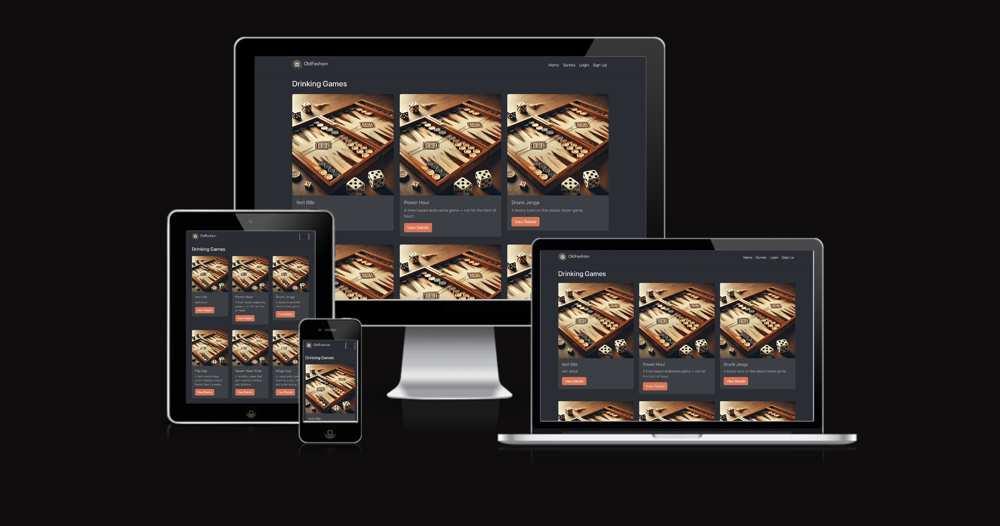

source: [amiresponsive](https://ui.dev/amiresponsive?url=https://!!!!!!!!.herokuapp.com)

## UX

For the SKP design I had to consider the USER’S needs:
-	Website to be simple,
-	Easily fluid to get around the site,
-	Keep their data secure,
-	Option for the owner to have an administration section private only for the owner,
-	Implement CRUD design features & where needed defensive programming.

### Colour Scheme

The color scheme for Old Fashion is inspired by the warm, inviting atmosphere of a classic pub or cocktail lounge. We went with deep, smoky tones paired with subtle golds and warm neutrals to evoke a sense of nostalgia and laid-back social energy — much like the drink it's named after. These colors help create a cozy, stylish environment that encourages users to explore, contribute, and connect. The overall goal was to balance readability with aesthetic, while giving the site a unique personality that feels both fun and mature.

### Typography

For Old Fashion, we chose a typeface that blends modern clarity with vintage charm to complement the site's theme. The primary font is clean and easy to read on all screen sizes, ensuring accessibility without sacrificing style. 

## User Stories

-   As a User I can view a navbar from every page so that I can navigate easily between pages
-   As a user I can create a new account so that I can access all the features for signed up user
-   As a user I can sign in to the app so that I can access functionality for logged in users
-   As a user I can tell if I am logged in or not so that I can log in if I need to
-   As a user I can view the details of a single post so that I can learn more about it
-   As a logged out user I can see sign in and sign up options so that I can sign in/sign up
-   As a logged in user I can like a post so that I can show my support for the posts that interest me
-   As a logged in user I can create posts so that I can share my game with the world

## Features

### Existing Features

- **Sign Up-#1**

    - Once clicked on the navigation bar. The sign up form appears. If not filled correctly pop ups appear informing the user that the field has not been entered or the passwords do not match. Once completed correctly a confirmation message appears. Then a redirect to the login page. 

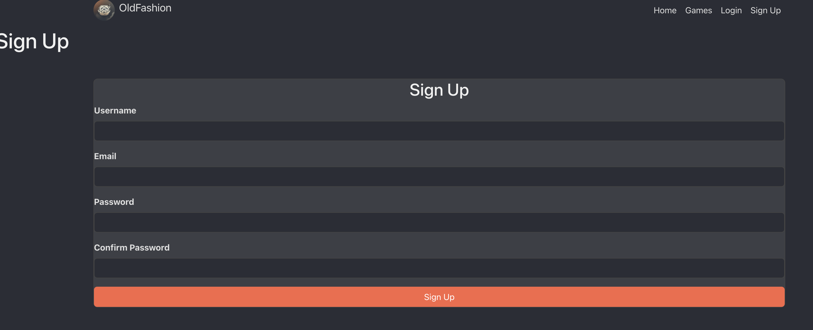

- **Login-#2**

    - Once correct user information is added you are then redirected to the profile page. If in correct login details are added a message will appear informing that the users login information is incorrect.

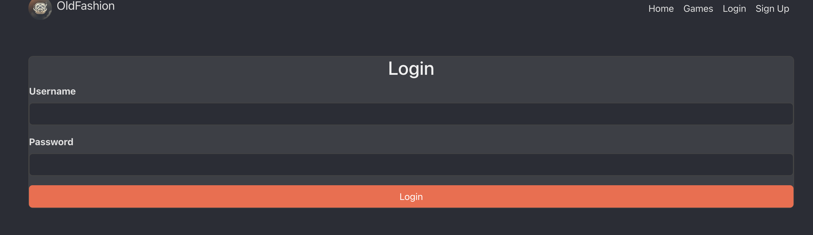

- **User Profile-#3/4**

    - If logged in, you are able to edit your profile or delete your account.
    - Once edited youcan either save changes or cancel.
    - If you delete your account a message will appear to confirm your choice.
    - Login button is now changed to Logout on the navigation bar.

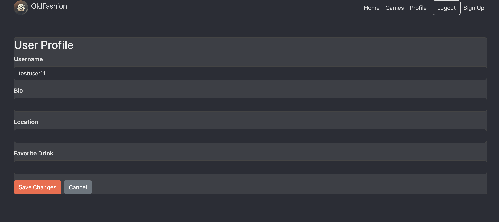
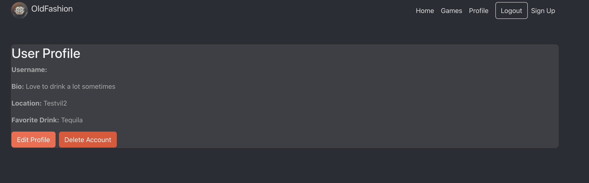

- **Games-#5/6**

    - This is where all the users games are stored.
    - They are able to add a new game or delete an exsiting game.

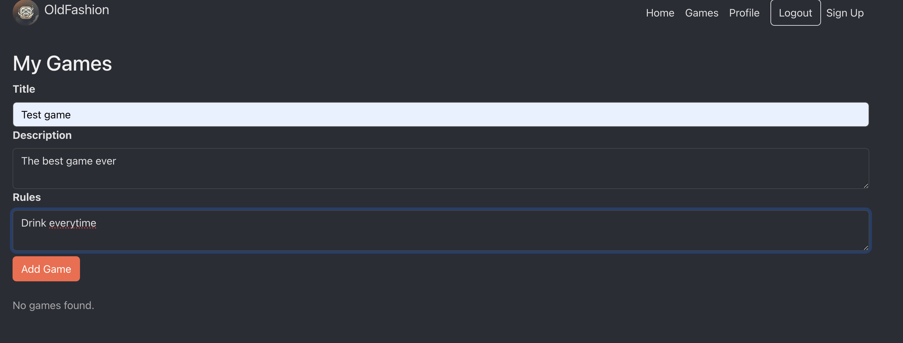
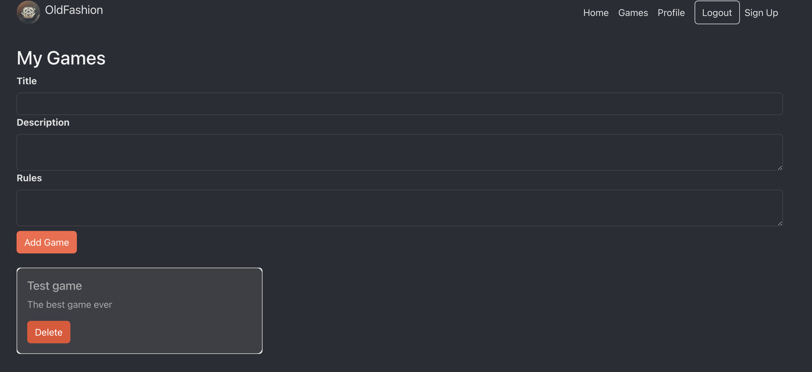

- **Home-#7**

    - This is where all the games are stored.
    - You are able to get here via the navigation home button or via the Old Fashion title in the top left      corner.
    - Access to the view details of the game.

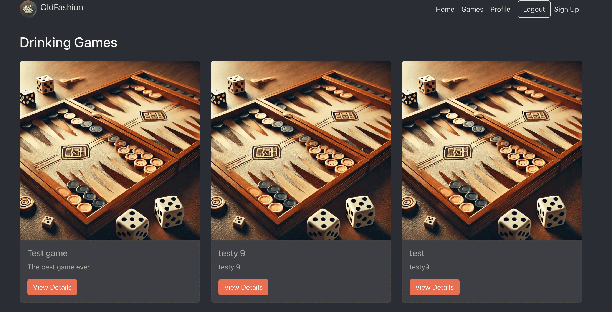

- **Game Details-#8/9/10**

    - This is where the user can view the rules, description, the likes, and comments.
    - The user is able to leave a like, or unlike a game.
    - Add a comment and view comments.
    - Edit their comment.
    - Delete their comment with a confirmation message.

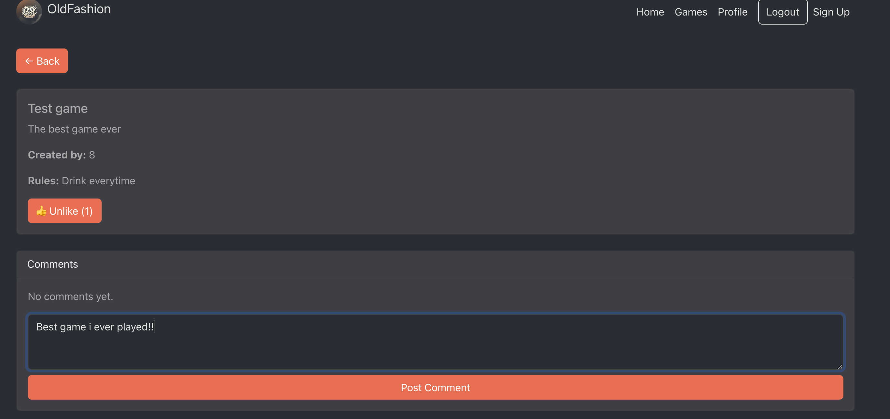
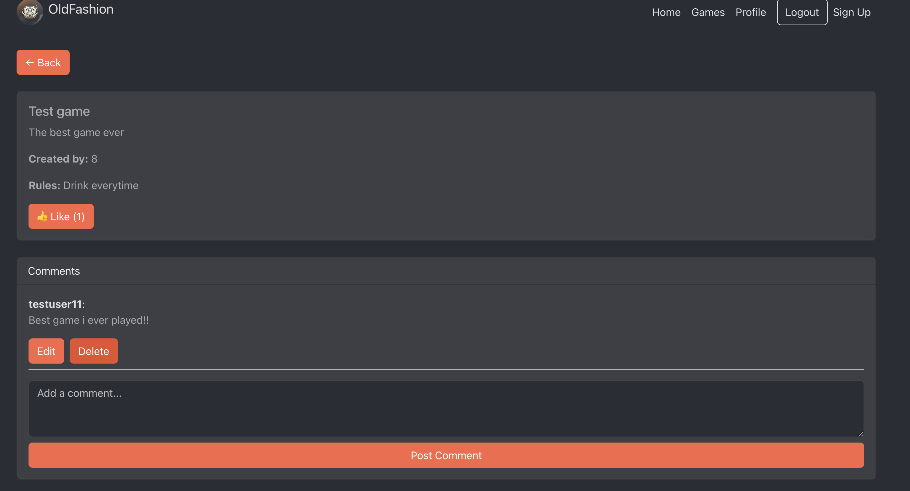
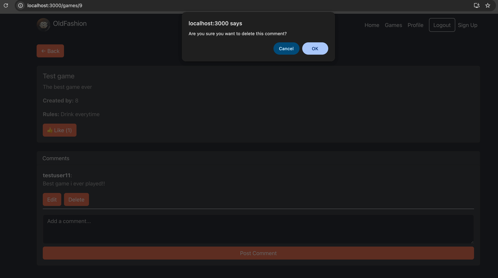

- **Mobile View-#11**

    - For navigation there is a drop down menu.

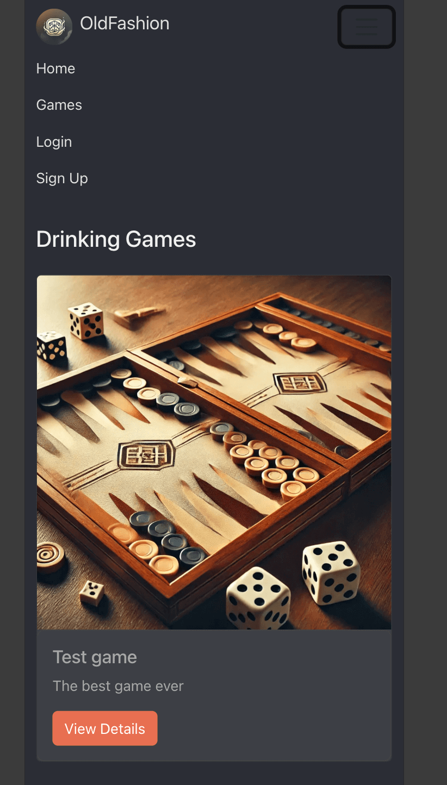


### Future Features

- **Social & Community**

- Friend System: Allow users to follow each other and see their friends’ uploaded games or activity.

- Private Messaging: Enable private chats between users to discuss games or plan events.

- Leaderboards: Showcase top contributors, most liked games, or most active users.

- **Game Interaction**

- Game Categories & Tags: Sort games by type (e.g., card, dice, outdoor, fast-paced, etc.) or user-defined tags. Add a Search Bar.

- Game Difficulty & Duration Filters: Help users quickly find suitable games for their setting.

- Save to Favorites: Let users bookmark games they love or want to try later.

- **Media & Engagement**

- Image/Video Uploads: Allow users to attach visuals or short videos to their game submissions for better instructions or entertainment.

- User Reactions: Add emoji-style reactions in addition to likes and comments.

- Game Rating System: Let users rate games from 1–5 stars for quick quality indicators.

- **Profile & Customization**

- Profile Badges: Award badges for milestones (e.g., first post, 100 likes, etc.).

- Custom Avatars or Themes: Let users personalize their profile appearance or site theme.

- **Real-world Integration**

- Party Planner Tool: Allow users to build a game playlist for events.

- Location-Based Game Trends: Show what’s trending in specific areas (using geolocation optionally).

- **Mobile-Friendly Additions**

- Offline Mode (PWA): Let users access saved games even without internet.

- QR Code Sharing: Generate a QR code to quickly share a game with friends in person.

## Tools & Technologies Used

- [](https://gitpod.io) used as a cloud-based IDE for development.
- [](https://en.wikipedia.org/wiki/CSS) used for the main site design and layout.
- [](https://www.javascript.com) used for user interaction on the site.
- [](https://www.python.org) used as the back-end programming language.
- [](https://www.heroku.com) used for hosting the deployed back-end site.
- [](https://getbootstrap.com) used as the front-end CSS framework for modern responsiveness and pre-built components.
- [](https://www.djangoproject.com) used as the Python framework for the site.
- [](https://www.postgresql.org) used as the relational database management.
- [](https://whitenoise.readthedocs.io) used for serving static files with Heroku.
- [](https://fontawesome.com) used for the icons.


## Database Design

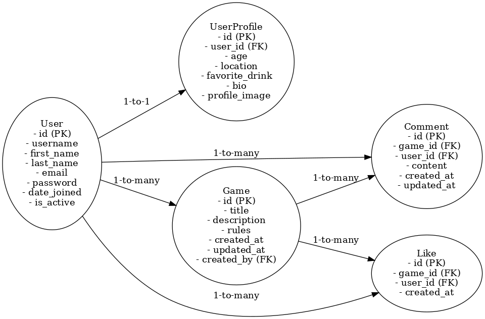

## Agile Development Process

### GitHub Projects

[GitHub Projects](https://github.com/Stocks84/!!!!!!/projects) served as an Agile tool for this project.
It isn't a specialized tool, but with the right tags and project creation/issue assignments, it can be made to work.

Through it, user stories, issues, and milestone tasks were planned, then tracked on a weekly basis using the basic Kanban board.

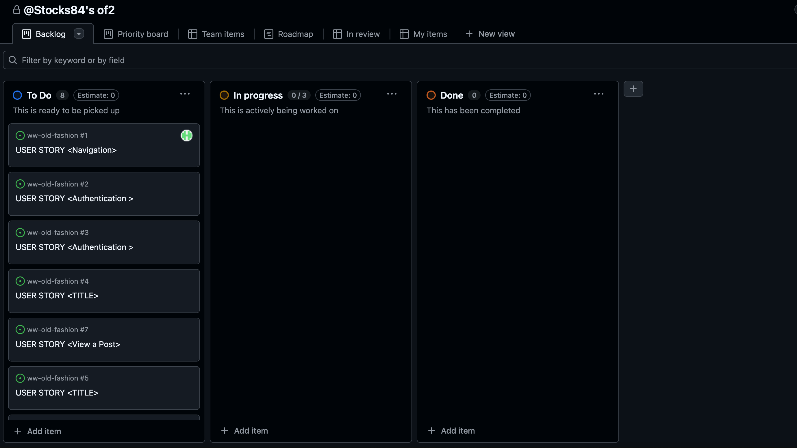

### GitHub Issues

[GitHub Issues](https://github.com/Stocks84/!!!!!!/issues) served as an another Agile tool.
There, I used my own **User Story Template** to manage user stories.

It also helped with milestone iterations on a weekly basis.

- [Open Issues](https://github.com/Stocks84/!!!!!!!!!/issues) [](https://github.com/Stocks84/!!!!!!!!/issues)

   

- [Closed Issues](https://github.com/Stocks84/!!!!!!!!/issues?q=is%3Aissue+is%3Aclosed) [](https://github.com/Stocks84/!!!!!!!!!/issues?q=is%3Aissue+is%3Aclosed)

## Testing

> [!NOTE]  
> For all testing, please refer to the [TESTING.md](TESTING.md) file.

## Deployment

The live deployed application can be found deployed on [Heroku](https://!!!!!!!!!!!.herokuapp.com).

### Heroku Deployment

This project uses [Heroku](https://www.heroku.com), a platform as a service (PaaS) that enables developers to build, run, and operate applications entirely in the cloud.

Deployment steps are as follows, after account setup:

- Select **New** in the top-right corner of your Heroku Dashboard, and select **Create new app** from the dropdown menu.
- Your app name must be unique, and then choose a region closest to you (EU or USA), and finally, select **Create App**.
- From the new app **Settings**, click **Reveal Config Vars**, and set your environment variables.

> [!IMPORTANT]  
> This is a sample only; you would replace the values with your own if cloning/forking my repository.

| Key | Value |
| --- | --- |
| `CLOUDINARY_URL` | user's own value |
| `DATABASE_URL` | user's own value |
| `DISABLE_COLLECTSTATIC` | 1 (*this is temporary, and can be removed for the final deployment*) |
| `SECRET_KEY` | user's own value |

Heroku needs three additional files in order to deploy properly.

- requirements.txt
- Procfile
- runtime.txt

You can install this project's **requirements** (where applicable) using:

- `pip3 install -r requirements.txt`

If you have your own packages that have been installed, then the requirements file needs updated using:

- `pip3 freeze --local > requirements.txt`

The **Procfile** can be created with the following command:

- `echo web: gunicorn app_name.wsgi > Procfile`
- *replace **app_name** with the name of your primary Django app name; the folder where settings.py is located*

The **runtime.txt** file needs to know which Python version you're using:
1. type: `python3 --version` in the terminal.
2. in the **runtime.txt** file, add your Python version:
    - `python-3.9.18`

For Heroku deployment, follow these steps to connect your own GitHub repository to the newly created app:

Either:

- Select **Automatic Deployment** from the Heroku app.

Or:

- In the Terminal/CLI, connect to Heroku using this command: `heroku login -i`
- Set the remote for Heroku: `heroku git:remote -a app_name` (replace *app_name* with your app name)
- After performing the standard Git `add`, `commit`, and `push` to GitHub, you can now type:
    - `git push heroku main`

The project should now be connected and deployed to Heroku!

### Local Deployment

This project can be cloned or forked in order to make a local copy on your own system.

For either method, you will need to install any applicable packages found within the *requirements.txt* file.

- `pip3 install -r requirements.txt`.

You will need to create a new file called `env.py` at the root-level,
and include the same environment variables listed above from the Heroku deployment steps.

> [!IMPORTANT]  
> This is a sample only; you would replace the values with your own if cloning/forking my repository.

Sample `env.py` file:

```python
import os

os.environ.setdefault("CLOUDINARY_URL", "user's own value")
os.environ.setdefault("DATABASE_URL", "user's own value")
os.environ.setdefault("SECRET_KEY", "user's own value")

# local environment only (do not include these in production/deployment!)
os.environ.setdefault("DEBUG", "True")
```

Once the project is cloned or forked, in order to run it locally, you'll need to follow these steps:

- Start the Django app: `python3 manage.py runserver`
- Stop the app once it's loaded: `CTRL+C` or `⌘+C` (Mac)
- Make any necessary migrations: `python3 manage.py makemigrations`
- Migrate the data to the database: `python3 manage.py migrate`
- Create a superuser: `python3 manage.py createsuperuser`
- Load fixtures (if applicable): `python3 manage.py loaddata file-name.json` (repeat for each file)
- Everything should be ready now, so run the Django app again: `python3 manage.py runserver`

#### Cloning

You can clone the repository by following these steps:

1. Go to the [GitHub repository](https://github.com/Stocks84/!!!!!!!!!!) 
2. Locate the Code button above the list of files and click it 
3. Select if you prefer to clone using HTTPS, SSH, or GitHub CLI and click the copy button to copy the URL to your clipboard
4. Open Git Bash or Terminal
5. Change the current working directory to the one where you want the cloned directory
6. In your IDE Terminal, type the following command to clone my repository:
    - `git clone https://github.com/Stocks84/!!!!!!!!!.git`
7. Press Enter to create your local clone.

Alternatively, if using Gitpod, you can click below to create your own workspace using this repository.

[](https://gitpod.io/#https://github.com/Stocks84/!!!!!!!!!!!!)

Please note that in order to directly open the project in Gitpod, you need to have the browser extension installed.
A tutorial on how to do that can be found [here](https://www.gitpod.io/docs/configure/user-settings/browser-extension).

#### Forking

By forking the GitHub Repository, we make a copy of the original repository on our GitHub account to view and/or make changes without affecting the original owner's repository.
You can fork this repository by using the following steps:

1. Log in to GitHub and locate the [GitHub Repository](https://github.com/Stocks84/!!!!!!!!!!!!)
2. At the top of the Repository (not top of page) just above the "Settings" Button on the menu, locate the "Fork" Button.
3. Once clicked, you should now have a copy of the original repository in your own GitHub account!

## Credits

### Content

| Source | Location | Notes |
| --- | --- | --- |
| [W3Schools](https://www.w3schools.com/howto/howto_js_topnav_responsive.asp) | entire site | responsive HTML/CSS/JS navbar |
| [W3Schools](https://www.w3schools.com/howto/howto_css_modals.asp) | contact page | interactive pop-up (modal) |
| [W3Schools](https://www.w3schools.com/css/css3_variables.asp) | entire site | how to use CSS :root variables |
| [Flexbox Froggy](https://flexboxfroggy.com/) | entire site | modern responsive layouts |
| [Grid Garden](https://cssgridgarden.com) | entire site | modern responsive layouts |
| [strftime](https://strftime.org) | CRUD functionality | helpful tool to format date/time from string |
| [WhiteNoise](http://whitenoise.evans.io) | entire site | hosting static files on Heroku temporarily |

### Media

| Source | Location | Type | Notes |
| --- | --- | --- | --- |
| [TinyPNG](https://tinypng.com) | entire site | image | tool for image compression |

### Acknowledgements

- I would like to thank my partner in crime Sanja who has helped keep me motivated during the house move, with my work, and with the arrival of our new daughter Nora.
- I would like to thank my friends for moral support
- I would like to mention as well that i loved doing this project and learned more than i could imagine. However i went through some more issues where i had to start again on this project a few times hence i ran out of time and the CSS styling and some other ideas were not implemented. Like i said i have learned a lot about myself and coding.
- I like to thank the code institute support team as i know i have been a pain but helped with my issues such as my Candida, my work schedule as a bodyguard where i have been in and out of contact throughout.
